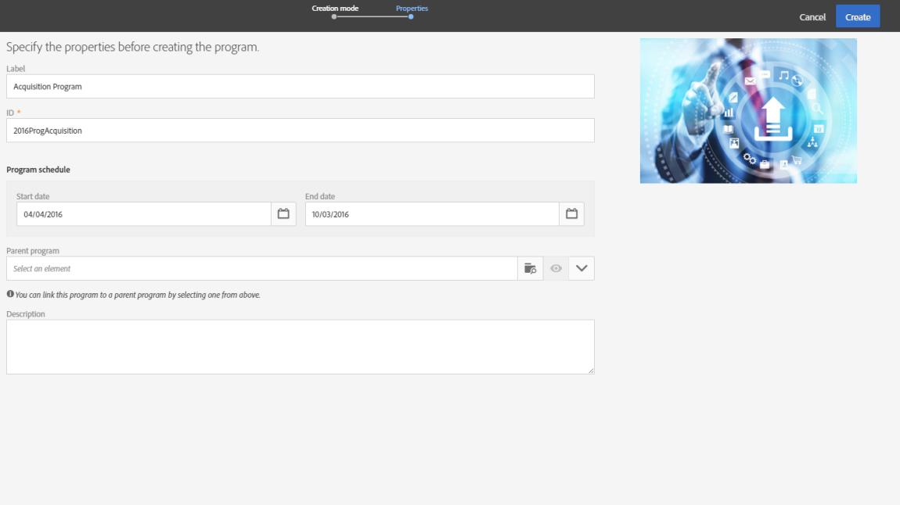

# Program och kampanjer{#programs-and-campaigns}

## Om planer, program och kampanjer {#about-plans--programs-and-campaigns}

Med Adobe Campaign kan du planera marknadsföringskampanjer där du kan skapa och hantera olika typer av aktiviteter: e-post, SMS-meddelanden, push-meddelanden, arbetsflöden och landningssidor. Dessa kampanjer och deras innehåll kan samlas i program.

Med programmen och kampanjerna kan du gruppera om och visa de olika marknadsföringsaktiviteterna som är kopplade till dem.

* Ett **program** kan innehålla andra program och även kampanjer, arbetsflöden och landningssidor. Det visas på tidslinjen och hjälper dig att ordna dina marknadsföringsaktiviteter. Du kan separera dem per land, varumärke, enhet etc.
* Med en **kampanj** kan du samla in alla marknadsföringsaktiviteter ni väljer inom en och samma enhet. En kampanj kan innehålla E-post, SMS, push-meddelanden, direktmeddelanden, arbetsflöden och landningssidor.

Adobe rekommenderar följande hierarki för att bättre organisera din marknadsföringsplanering: Program > Underprogram > Kampanjer > Arbetsflöden > Leveranser.

Rapporter om program och kampanjer gör det möjligt att analysera effekten. Du kan exempelvis skapa rapporter på kampanjnivå för att samla in data om alla leveranser som ingår i kampanjen.

**Relaterade ämnen:**

* [Tidslinje](../../start/using/timeline.md)
* [Om dynamiska rapporter](../../reporting/using/about-dynamic-reports.md)

## Skapa ett program {#creating-a-program}

Programmet är den första organisationsnivån. Den kan innehålla underprogram, kampanjer, arbetsflöden eller landningssidor.

1. Välj kortet **[!UICONTROL Programs & Campaigns]** på startsidan för Adobe Campaign.
1. Klicka på knappen **[!UICONTROL Create]**.
1. Välj en programtyp på skärmen **[!UICONTROL Creation mode]**.

   

   De tillgängliga programtyperna baseras på mallar som definieras i **[!UICONTROL Resources]** > **[!UICONTROL Templates]** > **[!UICONTROL Program templates]** . Mer information om detta hittar du i avsnittet [Hantera mallar](../../start/using/marketing-activity-templates.md) .

1. Ange programmets namn och ID på skärmen **[!UICONTROL Properties]**.

   

1. Välj ett start- och slutdatum för programmet. Dessa datum gäller endast självaste programmet.

   Du kan skapa programmet i ett överordnat program. För att göra detta väljer du det överordnade programmet bland de befintliga programmen.

1. Klicka på **[!UICONTROL Create]** för att bekräfta att programmet har skapats.

Programmet skapas och visas. Använd knappen **[!UICONTROL Create]** för att lägga till underprogram, kampanjer, arbetsflöden eller landningssidor.

>[!NOTE]
>
>Du kan också skapa ett program från listan med marknadsföringsaktiviteter.

## Skapa en kampanj {#creating-a-campaign}

I program och underprogram kan du lägga till kampanjer. Kampanjer kan innehålla marknadsföringsaktiviteter som E-post, SMS, push-meddelanden, arbetsflöden och landningssidor.

1. På startsidan för Adobe Campaign väljer du kortet **[!UICONTROL Programs & Campaigns]** och öppnar ett program eller underprogram.
1. Klicka på knappen **[!UICONTROL Create]** och välj **[!UICONTROL Campaign]**.
1. Välj en kampanjtyp på skärmen **[!UICONTROL Creation mode]**.

   

   De tillgängliga kampanjtyperna baseras på mallar som definieras i **[!UICONTROL Resources]** > **[!UICONTROL Templates]** > **[!UICONTROL Campaign templates]**. Mer information om detta hittar du i avsnittet [Hantera mallar](../../start/using/marketing-activity-templates.md) .

1. Ange kampanjens namn och ID på skärmen **[!UICONTROL Properties]**.
1. Välj ett start- och slutdatum för kampanjen. Dessa datum gäller endast självaste kampanjen.

   

1. Klicka på **[!UICONTROL Create]** för att bekräfta att kampanjen har skapats.

Kampanjen skapas och visas. Använd knappen **[!UICONTROL Create]** för att lägga till marknadsföringsaktiviteter i kampanjen.

>[!NOTE]
>
>Beroende på licensavtalet kan du endast få tillgång till vissa av dessa aktiviteter.

Du kan också skapa en kampanj från listan med marknadsföringsaktiviteter. Du kan välja att länka marknadsföringsaktiviteten till ett överordnat program eller delprogram via kampanjens fönster med egenskaper.

## Program- och kampanjikoner och status {#programs-and-campaigns-icons-and-statuses}

Varje program och kampanj i listan har en visuell symbol och en ikon vars färg anger körningsstatus. Statusen baseras på programmets eller kampanjens giltighetsperiod.

* Grå: programmet/kampanjen har inte startas ännu - status **[!UICONTROL Editing]**.
* Blå: programmet/kampanjen pågår - status **[!UICONTROL In progress]**.
* Grön: programmet/kampanjen har slutförts - status **[!UICONTROL Finished]**. Som standard visas det aktuella datumet automatiskt som giltighetens startdatum och slutdatumet beräknas enligt startdatumet (**D+186 dagar**). Du kan ändra dessa datum i programmet eller egenskaperna för kampanjen.

