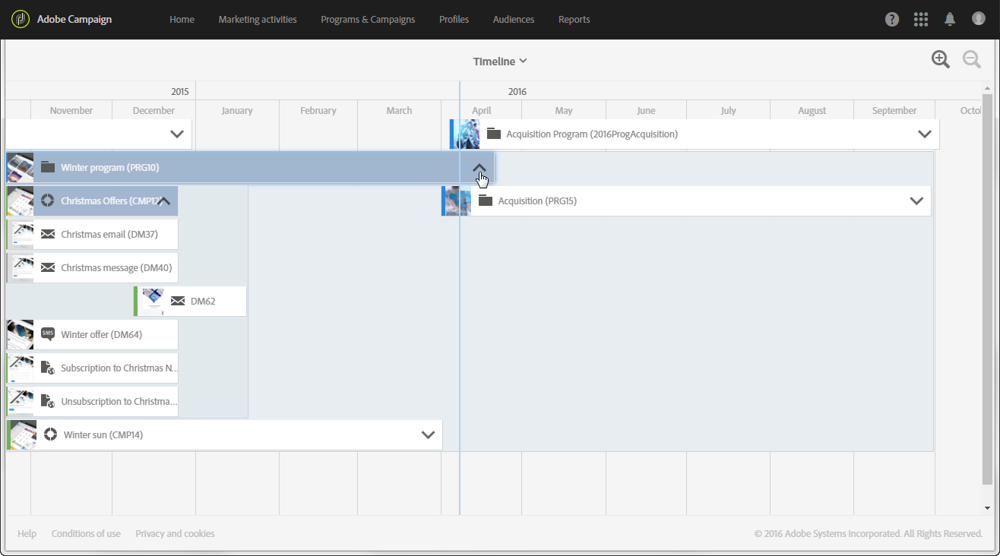

# Tidslinje{#timeline}

Med **[!UICONTROL Timeline]** kan du visualisera pågående program och deras innehåll.

Du öppnar tidslinjen genom att klicka på motsvarande kort på startsidan.

Som standard innehåller tidslinjen bara information om program, som visas kronologiskt mellan definierade start- och slutdatum.

Varje program representeras av en ruta som innehåller motsvarande miniatyrbild och etikett. Beroende på skärmstorleken och antalet element som ska visas kan etiketten ersättas med program-ID:t.

Den blå lodräta linjen är en kronologisk markör som markerar det aktuella datumet. Som standard finns den mitt på skärmen. Du kan bläddra åt höger eller vänster på skärmen för att ändra den period som visas.

Med knapparna  och  kan du öka eller minska området. Med knappen  ökar du dessutom detaljnivån under en mer begränsad period, tills dagar visas, och med knappen  kan du visa en större period.

Klicka på pilen till höger om respektive programnamn för att visa motsvarande innehåll. Ett program kan innehålla delprogram, kampanjer och landningssidor. En kampanj körs på samma sätt som ett program och kan innehålla e-post, SMS och landningssidor.

>[!NOTE]
>
>Eftersom arbetsflöden inte har en viss uppfattning om ett datum visas de inte på tidslinjen.

När innehållet i ett program eller en kampanj visas blir motsvarande ruta blå och pilen på höger sida blir upp och ned. Klicka på pilen igen för att dölja innehållet.

Varje element har en ikon som motsvarar dess typ:

*  : Program
*  : Kampanj
*  : Landningssida
*  : E-post
*  : SMS
*  : Push-meddelande

Den färgade raden till vänster om varje ruta anger statusen för det aktuella elementet.

* När ett element inte har startats ännu är linjen grå.
* Om ett element bearbetas är raden blå.
* Så fort ett element är färdigt blir raden grön.

Klicka på ett program eller något annat element som visas för att visa motsvarande kort. Klicka sedan på kortet för att gå direkt till innehållet i det markerade elementet och ändra det.

Klicka någon annanstans på skärmen om du vill dölja kortet.
